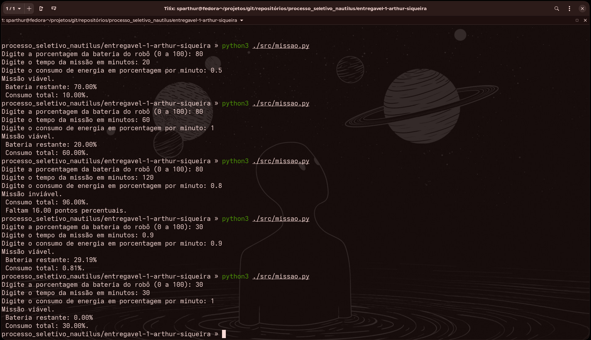
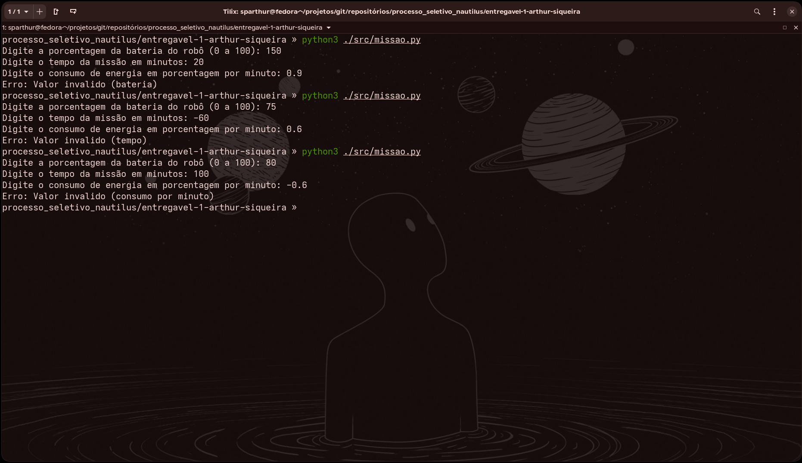

# Entregável 1 - Teste de Bateria para Robôs 🤖

O programa um programa para analise da viabilidade de bateria de um robô de acordo com os seguintes Critérios:

1. Bateria atual, em porcentagem.🔋
2. Tempo de missão, em Minutos.🕦
3. Consumo pro minuto, em percentuais da bateria.📊

## ESTRUTURA DO CÓDIGO 🧬

- Robo é uma classe que recebe os valores de bateria, tempo e consumo e calcula a energia necessaria e restante para verificar se a missão é viavel.
- Buscar informações é uma função pára solicitar e verificar os valores a serem calculados.
- Entregar informações é uma função para devolver essas informações
- A função main é usada para chamar as outras funções e conecta-las

## TO-DO ✅

- [x] Estruturar o programa.
- [x] Criar a classe Robo.
- [x] Criar funções específicas.
- [x] Criar função principal (main).
- [x] Testar funcionamento do programa.

## Testes 📋

seguem anexadas imagens de testes via terminal

**1. Testes com valores validos**

**2. Testes com valores invalidos**

